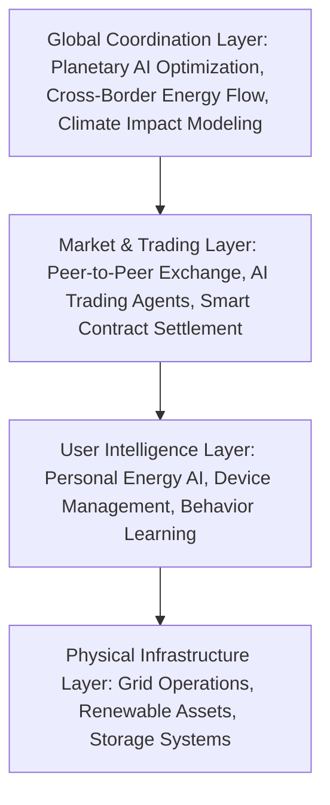
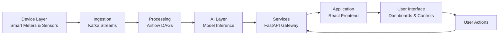

## 1. System Overview

Enerwise is a multi-layer intelligent energy ecosystem connecting individuals, grids, and AI coordination into one seamless architecture.

### High-Level Architecture

## 2. Core Technology Stack

| Component | Technology Implementation | Function |
|-----------|---------------------------|----------|
| Frontend | Next.js with React and TailwindCSS | Responsive web and mobile interface |
| Backend | FastAPI (Python) | REST API and AI endpoint services |
| Database | PostgreSQL with TimescaleDB extension | Time-series energy data storage |
| AI Models | LSTM, Transformer, XGBoost, Reinforcement Learning | Forecasting and optimization engines |
| ML Infrastructure | PyTorch, TensorFlow, MLflow | Model development and deployment |
| Data Pipeline | Apache Kafka, Airflow | Real-time data processing |
| Cloud Platform | AWS/GCP with Kubernetes | Scalable infrastructure |
| Security | OAuth2, JWT, AES-256 encryption | Authentication and data protection |
| Visualization | Three.js, WebGL | Energy data representation |
| IoT Protocol | MQTT, Modbus, Matter | Device communication standards |
| Trading System | Blockchain-based settlement | P2P energy transactions |
| Edge Computing | ONNX Runtime, TensorRT | Local model inference |

---

## 3. AI Architecture

Enerwise implements a multi-agent system where specialized AI components handle distinct energy coordination tasks.

### AI Agent Specifications

| Agent | Primary Function | Technical Approach |
|-------|------------------|-------------------|
| Forecasting Agent | Demand, price, and generation prediction | LSTM networks, Transformer models |
| Trading Agent | Market decision execution | Deep Reinforcement Learning (PPO, DQN) |
| Battery Agent | Storage optimization | Q-learning with constraint handling |
| Grid Agent | Load balancing and fault prediction | Graph Neural Networks |
| Personal Agent | User behavior adaptation | Transfer learning with privacy preservation |
| Orchestrator Agent | Multi-agent coordination | Multi-agent reinforcement learning |

---

## 4. Data Flow Architecture

---

## 5. System Modules

### Data Management
- Time-series data collection from energy assets
- Feature engineering for machine learning
- Data quality validation pipelines

### Model Development
- Forecasting models for energy patterns
- Reinforcement learning for optimization
- Continuous model evaluation and retraining

### Backend Services
- API endpoints for system functionality
- Authentication and authorization
- Integration with external systems

### Frontend Application
- Energy monitoring dashboards
- Trading and control interfaces
- Mobile application components

### Agent Framework
- Modular AI agent architecture
- Inter-agent communication bus
- Plug-in system for agent extensions

---

## 6. Security Framework

- End-to-end encryption for data transmission
- Zero-trust architecture implementation
- Decentralized transaction records
- Local data processing for sensitive information

---

## 7. Energy Market Layer

The system incorporates a decentralized exchange mechanism for energy trading:
- Automated smart contracts for settlement
- Tokenized energy unit representation
- Real-time meter verification
- Community energy pooling

---

## 8. Integration API

Enerwise provides standardized interfaces for:
- Electric vehicle charging infrastructure
- Residential energy storage systems
- Municipal microgrid operations
- Smart home automation platforms

Third-party developers can create applications within the Enerwise ecosystem for specialized energy optimization and analytics.

---

## 9. AI Infrastructure

| Component | Purpose |
|-----------|---------|
| MLflow | Model lifecycle management |
| Experiment Tracking | Performance monitoring and comparison |
| Kubernetes | Container orchestration for models |
| Hyperparameter Optimization | Automated model tuning |
| Workflow Orchestration | Pipeline management |
| Monitoring Stack | System observability and logging |

---

## 10. Scalability Design

- Container-based microservice architecture
- Stateless service design for horizontal scaling
- Automated resource allocation
- Efficient inter-service communication
- Continuous deployment pipelines

---

## 11. Development Roadmap

- Advanced optimization algorithms for grid management
- Ethical AI frameworks for automated decision making
- Extended energy logistics capabilities
- AI-assisted energy technology development

---

## 12. Summary

Enerwise represents a comprehensive architecture for intelligent energy management. The system integrates individual energy users with grid-scale operations through layered AI coordination, creating an adaptive and efficient energy ecosystem.

"Energy management requires intelligent coordination across all system layers."
