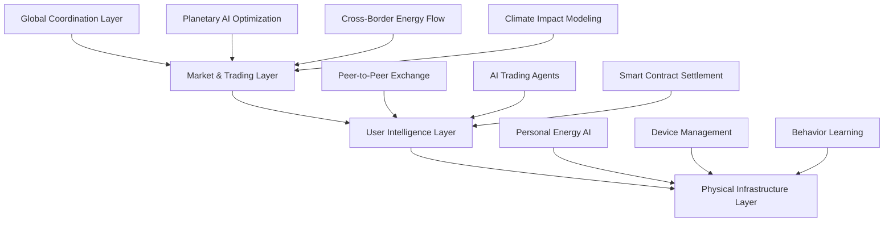

# Enerwise Ecosystem & Product Layer

Enerwise is a **user-centric, multi-layer energy ecosystem** connecting individuals, AI, and infrastructure in one seamless experience. This document focuses on **product perspective**, detailing ecosystem layers, user interaction, modules, and roadmap.

---

## 1. System Overview

The Enerwise ecosystem integrates AI-driven energy management, personal devices, and grid infrastructure into **an adaptive and intelligent user experience**.

### High-Level Ecosystem Layers

**Layer Descriptions:**

| Layer                   | Key Features                                                              |
| ----------------------- | ------------------------------------------------------------------------- |
| Global Coordination     | Planetary AI optimization, Cross-border energy flow, Climate modeling     |
| Market & Trading        | Peer-to-peer energy trading, AI trading agents, Smart contract settlement |
| User Intelligence       | Personal AI, Device management, Behavior learning & gamification          |
| Physical Infrastructure | Grid operations, Renewable assets, Storage systems, IoT devices           |

---

## 2. Product Modules

| Module                 | Description                                                                                                       |
| ---------------------- | ----------------------------------------------------------------------------------------------------------------- |
| Data Management        | Time-series collection, Data validation, Feature engineering                                                      |
| AI & Model Layer       | Forecasting models (LSTM, Transformer, XGBoost), Optimization agents (RL, GANs), Continuous improvement pipelines |
| Application Layer      | Web & mobile dashboards (React + TailwindCSS), Trading interface, Notifications & gamified achievements           |
| Security & Privacy     | End-to-end encryption, Local data processing, GDPR compliance                                                     |
| Community & Engagement | Peer-to-peer energy sharing, Social gamification, Community insights                                              |

---

## 3. Integration & API Layer

Enerwise provides standardized integration for:

* EV charging networks
* Home battery systems
* Smart home automation
* Municipal microgrids

Third-party developers can extend the ecosystem with applications, optimization tools, and analytics dashboards.

---

## 4. AI Infrastructure

| Component                   | Purpose                            |
| --------------------------- | ---------------------------------- |
| MLflow                      | Model lifecycle management         |
| Experiment Tracking         | AI performance monitoring          |
| Kubernetes                  | Deployment of scalable AI services |
| Hyperparameter Optimization | Auto-tuning of models              |
| Workflow Orchestration      | Continuous data & model pipelines  |
| Monitoring Stack            | Observability and logging          |

---

## 5. Scalability & UX

* Microservice-based modular architecture
* Mobile-first responsive design
* Efficient data flow for near-real-time insights
* Continuous deployment and automated testing pipelines

---

## 6. Product Roadmap

| Phase                               | Timeline     | Goals                                                                                                                  |
| ----------------------------------- | ------------ | ---------------------------------------------------------------------------------------------------------------------- |
| Phase 1: Personal Energy Experience | Months 1-12  | Launch MVP web/mobile app, integrate personal energy device monitoring, basic gamification & insights                  |
| Phase 2: Ecosystem Expansion        | Months 13-36 | Add peer-to-peer trading, integrate AI trading agents, expand device compatibility                                     |
| Phase 3: Global Coordination        | Months 37-60 | Planetary AI optimization, cross-border energy flow, full ecosystem integration with utilities & microgrids            |
| Phase 4: Legacy & Industry Standard | Year 5+      | Become default interface for energy management, enable widespread adoption & energy autonomy, continuous AI innovation |

---

## 7. Summary

The **Enerwise Ecosystem & Product Layer** presents a **human-centric view** of the intelligent energy ecosystem. It focuses on **usability, adoption, and community engagement**, ensuring the platform is **desirable, scalable, and sustainable**.

